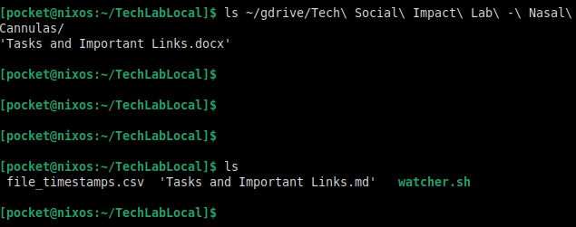

# ai-classmate
nix configuration and scripts for running hermes-agent with integrations to google drive, canvas, and discord-voice

## watcher
 * rclone mounts the google drive folder which has all the shared documents with teammates
 * in order to provide access to these files to local ai agents, a watcher script checks every 10s for changes/updates to anything in the gdrive and then converts the files into markdown or other ai-friendly formats in a local cache that the agents can then read
 * example: document converted from .docx to .md: 

## hermes-agent
 * https://github.com/nousresearch/hermes-agent

## hermes discord-voice
 * https://hermes-agent.nousresearch.com/docs/user-guide/features/voice-mode

## discord local voice recording and transcripts
 * https://github.com/CraigChat/craig
 * https://github.com/thewh1teagle/vibe
 * provides a backup copy of audio and transcripts from discord calls separate from the live voice interaction with hermes directly

## canvas-mcp
 * https://github.com/vishalsachdev/canvas-mcp
